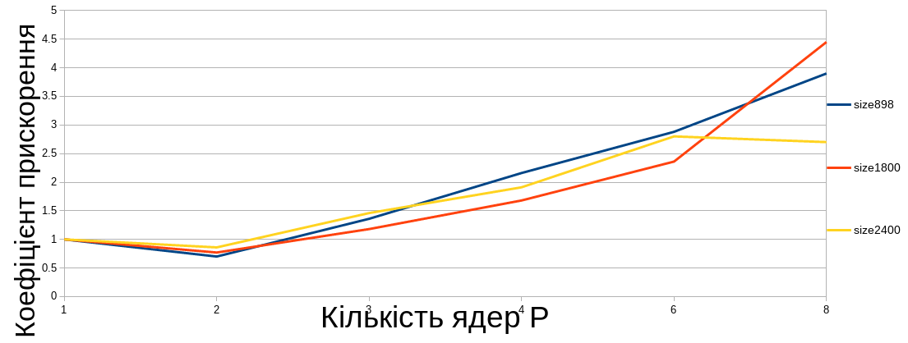
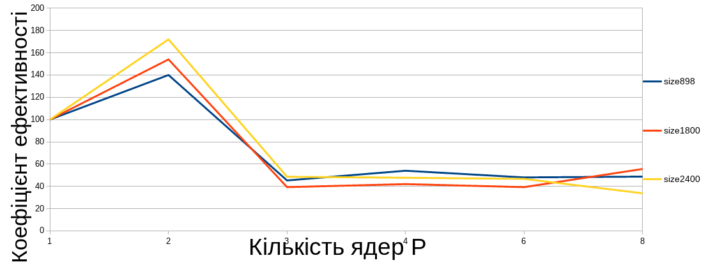
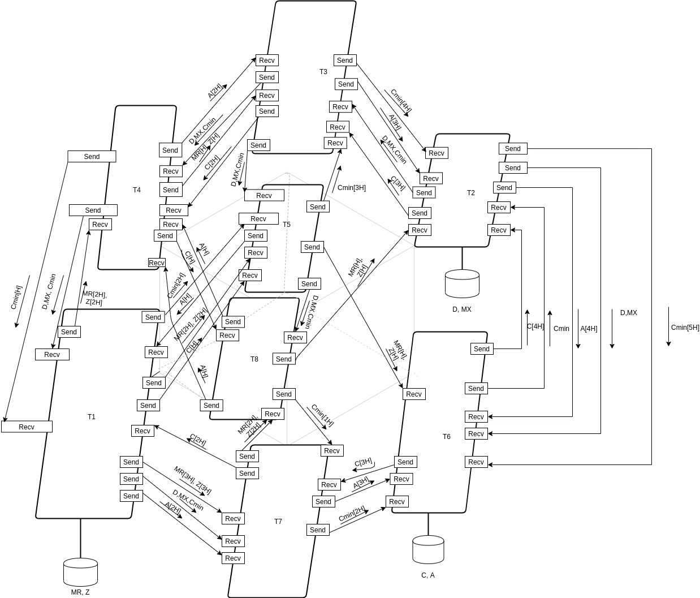

# Parallel Matrix Computation in Java and C++ using MPI

This project demonstrates a parallel implementation of a matrix-vector computation using **MPI (Message Passing Interface)** with **8 processes**. Two full implementations are included: one in **Java (MPJ Express)** and another in **C++ (OpenMPI)**.

---

## 🧮 Formula Computed
A = Cmin * Z + D * (MX × MR)

Where:
- `MX`, `MR`: input matrices
- `D`, `Z`, `C`: vectors
- `Cmin`: minimum element among segments of `C` distributed across processes
- `A`: resulting vector

---

## 🧠 Parallelization Design

- **Processes Used:** 8 (P = 8)
- Each process performs:
  - Matrix-vector multiplication
  - Vector element-wise operations
  - Participation in `MPI.Reduce`, `Send`, `Recv`, and `Barrier`
- Final result vector `A` is gathered and printed by rank 5

---

## 📂 Languages & Technologies

### 🔹 Java Version
- Language: Java
- Library: [MPJ Express](http://mpj-express.org)
- File: `ParallelMatrixComputation.java`
- Run: `mpjrun.sh -np 8 newProj.ParallelMatrixComputation`

### 🔹 C++ Version
- Language: C++
- Library: OpenMPI
- File: `ParallelMatrixSolver.cpp`
- Run: `mpirun -np 8 ./ParallelMatrixSolver`

---

## 📊 Performance Graphs

### 1️⃣ Speedup Coefficient vs Number of Cores  
📁 `gr1.png`

---

### 2️⃣ Efficiency Coefficient vs Number of Cores  

📁 `gr2.png`

---

### 3️⃣ Process Interaction Scheme    
📁 `im1.jpg`  
🗣️ **Translation:** *Design of Process Interaction Scheme*

---

## 💬 Key Features

- Fully parallel matrix-vector computation across 8 nodes
- Demonstrates use of both **collective** (`Reduce`, `Barrier`) and **point-to-point** (`Send`, `Recv`) communication
- Equivalent logic written in both **Java and C++**
- Designed for educational, benchmarking, or HPC demonstration purposes
